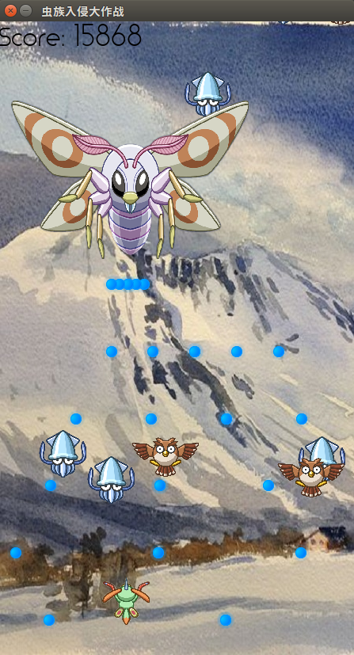

# petwings python - A Python Shooting Game
## Introduction
[petwings](http://www.saitogames.com/petwings/) was a game developed by [SAITO Game Studio](http://www.saitogames.com/index.htm) in Japan. 
It was once extremely popular in 2000. I love this game very much, so I create a simplified version of petwings with python. I hope you enjoy it, too.
Images are copied from [puppywings](http://www.saitogames.com/puppywings/index.htm) (Andriod game developed by the same studio, available on Google Play. 
Yeah, they have created an Android version of petwings!)


## Game Background 
The Zerg are invading, enemies from Zerg are reproduced very quickly, and they will become more and more strong as time pass.
The only way to win is to destroy the bee queen. If the boss die, enemies cannot reborn and lose their mobility. Try your best!

## Playing Instruction
- control yourself using mouse, press space key to fire 
- you can upgrade yourself by winning points
- gain one point for each bullet hitting enemy 
- gain different points according to your level and enemy type 
- gain bonus porints from destroying the boss 
- you will die if touched by enemy or hit by boss' bullet


## Installion/Requirement:
#### package used
- python 3.6+ 
- pygame 1.9+ 

#### Set up
```bash
pip install -r requirements.txt
```
#### Start the game
```bash
python game.py 
```

#### Demo


#### Build Executable
Why bother? It's 2020, download python!

deprecated: <del>run cx_Freeze with setup.py</del>


#### Credit
- Inspired by [petwings](http://www.saitogames.com/petwings/) and [puppywings](http://www.saitogames.com/puppywings/index.htm) (Android game developed by the same studio, available on Google Play)
- Enemy and pet images selected from [puppywings](http://www.saitogames.com/puppywings/index.htm)